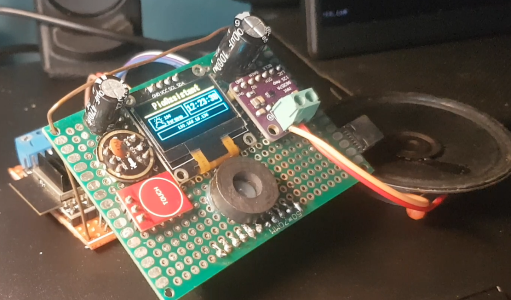
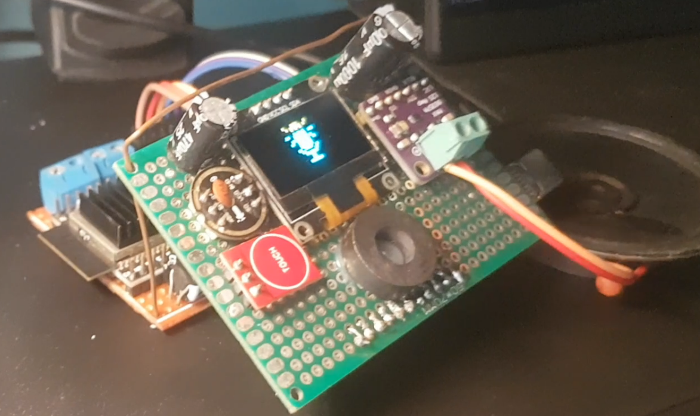

# ESP32 PioAssistant


An IoT voice assistant powered by ESP32-S3 firmware and AI from OpenAI. Features real-time speech recognition, text-to-speech, OLED display with face animations, and MQTT-based communication for seamless integration with external processing services.

## Features

- **Voice Interaction**: Speech-to-text via external Whisper API, text-to-speech output
- **Real-time Audio Processing**: I2S microphone input with noise suppression and VAD
- **Visual Feedback**: OLED display with animated faces and UI updates
- **MQTT Integration**: Communicates via MQTT for scalability (todo for future feature)
- **ESP32 Optimization**: Leverages PSRAM, dual cores, and FreeRTOS tasks
- **Weather Integration**: Real-time weather updates from BMKG API with animated icons and data display
- **AI Integration**: GPT-powered conversational responses and intelligent interactions
- **Dynamic Performance**: Automatic CPU frequency adjustment based on system activity
- **Enhanced Audio**: SAVE_AUDIO configuration, WAV/MP3 support, improved noise reduction
- **Advanced Task Management**: Suspendable tasks and background process monitoring
- **Expanded Display**: WifiDrawer, FaceDrawer, RecordDrawer with enhanced animations
- **Additional Services**: FTP server and time synchronization capabilities

## Architecture

The ESP32 firmware handles hardware control using FreeRTOS tasks:

- **MainTask**: Display/UI management with FaceDisplay animations
- **NetworkTask**: MQTT/WiFi connectivity
- **RecorderTask**: Audio capture and streaming

**Data Flow**: RecorderTask captures audio → saves to WAV file on LittleFS → ESP-SR transcribes locally → sends to GPT API for response → OpenAI TTS (if WiFi) or local TTS outputs speech

## Hardware Requirements

- **ESP32 Board**: ESP32-S3-DevKitC-1-N16R8 (16MB Flash, 8MB PSRAM) - Recommended. Other ESP32-S3 boards with sufficient PSRAM and flash can be tried.
- **Display**: I2C 128x64 OLED (e.g., SSD1306)
- **Microphone**:
  - I2S: INMP441 (tested), ICS-43434, SPH0645
  - Analog (not tested): MAX9814 or similar with gain control
  - PDM (not tested)
- **Speaker**: I2S for TTS output

## Software Requirements

- **PlatformIO**: For ESP32 firmware build and upload

## Installation & Setup

### 1. Clone Repository
```bash
git clone https://github.com/jahrulnr/smart-voice-esp32.git
cd smart-voice-esp32
```

### 2. Configuration
- Configure WiFi and MQTT in `include/secret.h` (copy from `secret.h.example`)

## Usage

1. **Power on ESP32**: Device connects to WiFi and MQTT broker
2. **Speak**: Audio captured via microphone, streamed to MQTT
3. **Processing**: Audio processed by external services
4. **Response**: Transcribed text received via MQTT, displayed on OLED

## Demo

Demo videos showcasing the ESP32 PioAssistant in action:

**Booting Sequence**: Device startup and initialization  
[](https://youtu.be/i8OGq0rFzss)

**Voice Interaction**: Speech and response  
[](https://youtu.be/-L65cWOtkxM)

## Development

### Building ESP32 Firmware
- Use PlatformIO IDE or CLI
- Custom partitions defined in `hiesp.csv`
- Build flags optimized for ESP32-S3 (PSRAM, ESP-SR, etc.)

## Troubleshooting

### WebSocket Issues
For WebSocket-related issues with the ESP32-GPT library (such as payload size limits or connection problems), see the ESP32-GPT documentation at [ESP32-GPT](https://github.com/jahrulnr/esp32-gpt)

## Contributing

1. Fork the repository
2. Create a feature branch
3. Make changes following the established patterns
4. Test builds and functionality
5. Submit a pull request

## License

MIT License